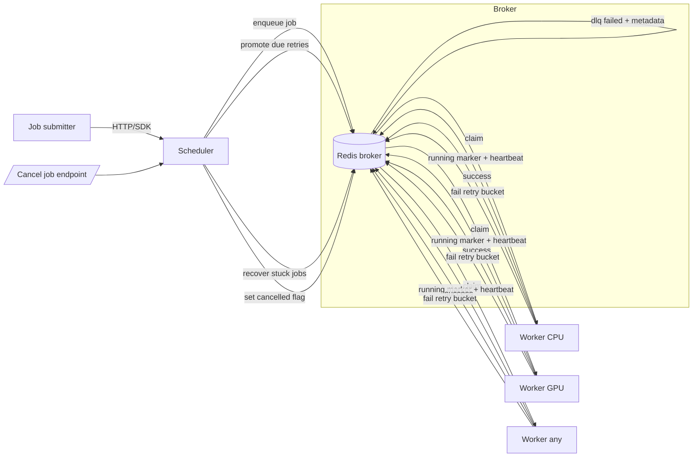

# Architecture Overview

## System Diagram

## Flow (Happy Path)

1. **Client submits job** → Scheduler writes `job:<id>` hash and enqueues to **Redis LIST** `queue:cpu|gpu|any`.
2. **Worker claims** from its queue via `BLPOP`, marks `running:<worker>` and sends heartbeats.
3. **Worker executes** with timeout + cancellation checks.
4. **On success**: job hash removed (or marked done for benchmarks).

## Retries & DLQ

1. **On failure**, worker calls `HandleJobFailure` → increments `retry_count`, either:
   - Schedules into **`retry:scheduled` ZSET** (with exponential backoff), or
   - Moves to **`dlq:failed` LIST** and `dlq:job:<id>` hash after exceeding `max_retries`.

2. **Scheduler loop** promotes due entries from `retry:scheduled` back into `queue:*` LISTs.

## Cancellation

- **API** `DELETE /api/jobs/{id}/cancel` sets `cancelled:<id>` and marks job `status=cancelled`.
- **Worker** checks `cancelled:<id>` before and after execution and marks job cancelled **without retry**.

## Latency Awareness & Rate Limits

- **Workers report** durations to Redis + Prometheus; `workers:latency` ZSET tracks average latency per worker.
- **Fetch logic** prefers queue matching worker type (CPU/GPU/any).
- **Rate limiter** uses:
  - `ratelimit:<queue>:<window>` (per-queue throttle)
  - `ratelimit:worker:<id>:<window>` (per-worker throttle)
  
  Both throttle enqueue/execute operations per minute.

## Speculative Execution (Planned)

- **Metric placeholder** exists for tracking stragglers.
- **Future hook** will enqueue duplicate of a straggling job to another worker when `running:*` exceeds a threshold.
- **Status**: Not yet implemented.

## Key Data Structures

| Key Pattern | Type | Purpose |
|-------------|------|---------|
| `job:<id>` | Hash | Job metadata (status, payload, retries, etc.) |
| `queue:cpu\|gpu\|any` | List | Pending jobs, claimed via `BLPOP` |
| `retry:scheduled` | ZSet | Failed jobs with retry timestamp as score |
| `dlq:failed` | List | Jobs that exceeded max retries |
| `dlq:job:<id>` | Hash | DLQ job metadata |
| `running:<worker_id>` | String | Heartbeat timestamp for active jobs |
| `cancelled:<id>` | String | Cancellation flag |
| `workers:latency` | ZSet | Worker ID → average latency |
| `ratelimit:*` | String | Rate limit counters with TTL |

## Architecture Notes

✅ **Correct:**
- Happy path, retry/DLQ logic, cancellation, latency tracking, rate limiting

⚠️ **Clarifications:**
- **Queues** (`queue:*`) are **Redis LISTs** (FIFO via `BLPOP`), **not ZSETs**
- **Retry bucket** (`retry:scheduled`) **is a ZSET** (sorted by due timestamp)
- **Success cleanup**: Job hash is deleted unless benchmarking mode retains it
- **Priority**: Currently FIFO within each queue; no score-based prioritization (could be added via ZSET migration)

---

**Note**: For true priority queuing, consider migrating `queue:*` from LISTs to ZSETs with job priority as negative score (to pop highest priority first).